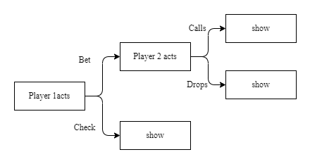

# Optimal Bluffing Strategies in Simple Poker

A small game-theoretic project studying bluffing behavior in a simplified two-player poker game with incomplete information.

## Overview

This project models poker bluffing as a sequential Bayesian game in which one player privately observes hand strength and strategically chooses whether to bluff.

Using Bayesian updating and indifference equations, the analysis derives the equilibrium bluffing frequency in a mixed-strategy Nash equilibrium and studies how bluffing behavior depends on prior probabilities of strong hands.

The project is inspired by classical poker models developed by von Neumann and Morgenstern, together with later work by Cassidy and Ferguson on equilibrium bluffing.

## Model

The game consists of:
- two players,
- incomplete information,
- binary hand strength (strong/weak),
- sequential betting decisions.

Player 1 may bluff with a weak hand, while Player 2 updates beliefs after observing a bet.

The equilibrium analysis uses:
- Bayesian updating,
- posterior belief computation,
- mixed-strategy Nash equilibrium,
- indifference conditions.

## Main Result

The equilibrium bluffing probability is

$$
\beta^* = \frac{p}{3(1-p)}
$$

where \(p\) denotes the probability that Player 1 holds a strong hand.

The model also discusses:
- reputation effects,
- bluff-catching preferences,
- volatility and limits of bluffing.

## Figure

### Extensive-form representation of the game



## Repository Structure

```text
figures/        game tree
abstract/       project abstract
references/     bibliography
```

## References

Key references include:

California Jack Cassidy, Early Round Bluffing in Poker
Ferguson, Ferguson & Gawargy, U(0,1) Two-Person Poker Models
Karlin & Peres, Game Theory, Alive
von Neumann & Morgenstern, Theory of Games and Economic Behavior

## Notes

This repository contains supplementary materials and a summary of the project.
Full write-up not publicly distributed.
